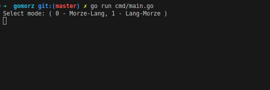
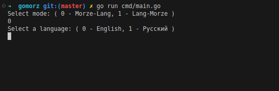
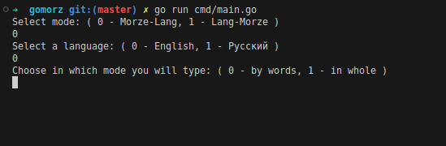
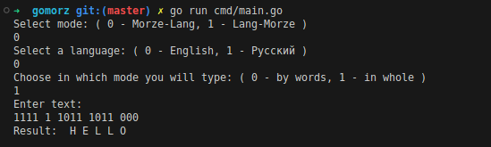

# gomorz

### You can translate Morse code text into regular and vice versa.

```sh
go run cmd/main.go
```
## How use it

Select mod. From Morze to Lang OR from Lang to Morze.




Select lang.



Choose how you will enter the text




Enjoy the result


